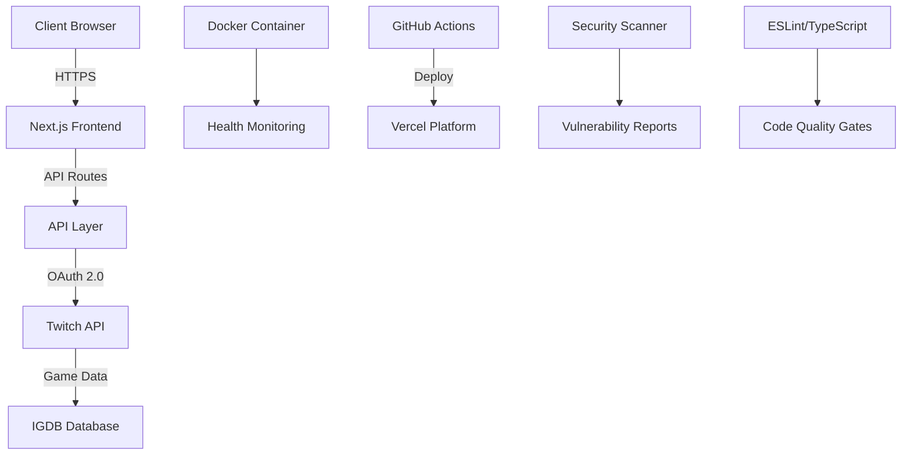

# 🎮 GameEvents - Gaming Release Calendar

[](https://github.com/Sovereign97/gameevents/actions)
[](https://hub.docker.com/r/sovereign97/gameevents)
[](https://opensource.org/licenses/MIT)
[](https://nextjs.org/)
[](https://www.typescriptlang.org/)

> A modern, DevOps-ready gaming events and release calendar powered by the IGDB API. Built to showcase modern development practices and deployment strategies.

## 🚀 Live Demo

**[Visit GameEvents →](https://gameevents.vercel.app)**

## 🎯 Project Overview

GameEvents is a **plug-and-play** gaming discovery platform that demonstrates modern full-stack development and DevOps practices. Perfect for showcasing technical skills to recruiters, this project implements industry-standard patterns for scalability, security, and maintainability.

### ✨ Key Features

- 📅 **Live Gaming Calendar** - Upcoming releases with real-time countdown timers
- 🔥 **Trending Games** - Popular games based on community hype
- 📱 **Responsive Design** - Modern, mobile-first UI with Tailwind CSS
- ⚡ **Real-time Updates** - Dynamic content updates without page refresh
- 🎨 **Modern UI/UX** - Clean, intuitive interface with smooth animations

## 🛠️ DevOps & Technical Highlights

### 🐳 Containerization
- **Multi-stage Docker builds** for optimized production images
- **Docker Compose** for local development and testing environments
- **Health checks** and monitoring built-in
- **Security-first** approach with non-root user containers

### 🔄 CI/CD Pipeline
```yaml
✅ Automated Testing & Linting
🔐 Security Vulnerability Scanning (Trivy)
📦 Multi-platform Docker Image Builds (AMD64/ARM64)
🚀 Automated Deployment to Vercel
🏥 Post-deployment Health Checks
📊 Build Artifact Caching for Performance
```

### 🔒 Security & Best Practices
- **Environment variable management** with validation
- **Security headers** implementation (CSP, HSTS, etc.)
- **Dependency vulnerability scanning**
- **Type safety** with TypeScript
- **Code quality** enforcement with ESLint/Prettier

### ⚡ Performance Optimization
- **Next.js App Router** with React Server Components
- **Image optimization** with Next.js Image component
- **API response caching** strategies
- **Bundle optimization** and code splitting

## 🏗️ Architecture



## 🚀 Quick Start

### Prerequisites
- Node.js 18+ and npm 8+
- Docker and Docker Compose
- Twitch Developer Account (for IGDB API access)

### 1. Environment Setup
```bash
# Clone the repository
git clone https://github.com/Sovereign97/gameevents.git
cd gameevents

# Copy environment template
cp .env.example .env.local

# Add your Twitch API credentials
echo "TWITCH_CLIENT_ID=your_client_id_here" >> .env.local
echo "TWITCH_CLIENT_SECRET=your_client_secret_here" >> .env.local
```

### 2. Development (Choose Your Method)

#### Option A: Local Development
```bash
npm install
npm run dev
```

#### Option B: Docker Development
```bash
npm run docker:dev
```

#### Option C: Production Docker
```bash
npm run docker:prod
```

### 3. Verify Installation
- **Application**: http://localhost:3000
- **Health Check**: http://localhost:3000/api/health

## 📋 Available Scripts

| Command | Description |
|---------|-------------|
| `npm run dev` | Start development server |
| `npm run build` | Build for production |
| `npm run start` | Start production server |
| `npm run lint` | Run ESLint |
| `npm run type-check` | Run TypeScript checks |
| `npm run test` | Run Jest tests |
| `npm run docker:build` | Build Docker image |
| `npm run docker:prod` | Run production container |
| `npm run health-check` | Verify application health |

## 🔧 Configuration

### Environment Variables
```bash
# Required
TWITCH_CLIENT_ID=your_twitch_client_id
TWITCH_CLIENT_SECRET=your_twitch_client_secret

# Optional
NEXT_PUBLIC_APP_URL=http://localhost:3000
NODE_ENV=production
```

### Docker Configuration
The application includes both development and production Docker configurations:

- **Development**: Hot-reload enabled, source maps, detailed logging
- **Production**: Optimized builds, security hardening, minimal attack surface

## 🧪 Testing & Quality Assurance

### Automated Testing
```bash
# Run all tests
npm test

# Run tests with coverage
npm run test:ci

# Run tests in watch mode
npm run test:watch
```

### Code Quality
- **ESLint** for code linting
- **TypeScript** for type safety
- **Prettier** for code formatting
- **Husky** for pre-commit hooks

## 📊 Monitoring & Observability

### Health Monitoring
The application includes a comprehensive health check endpoint (`/api/health`) that monitors:
- Application uptime
- External API connectivity
- Service dependencies
- Performance metrics

### Logging Strategy
- Structured logging with contextual information
- Error tracking and alerting
- Performance monitoring

## 🚢 Deployment

### Automatic Deployment
Push to `main` branch triggers:
1. **Automated testing** and quality checks
2. **Security scanning** for vulnerabilities
3. **Docker image** building and pushing
4. **Zero-downtime deployment** to Vercel
5. **Health check** validation

### Manual Deployment
```bash
# Build and deploy Docker image
docker build -t gameevents .
docker run -p 3000:3000 --env-file .env.local gameevents
```

## 🏢 Enterprise Considerations

This project demonstrates enterprise-ready patterns:

- **Scalability**: Containerized architecture ready for orchestration
- **Security**: Multi-layered security approach with scanning and headers
- **Observability**: Health checks, logging, and monitoring built-in
- **Maintainability**: Clean architecture with TypeScript and testing
- **DevOps Integration**: Full CI/CD pipeline with quality gates

## 🎓 Learning Outcomes

This project demonstrates proficiency in:

### Frontend Development
- React 18+ with Server Components
- Next.js App Router architecture
- TypeScript for type safety
- Tailwind CSS for modern styling
- Responsive design principles

### Backend Development
- RESTful API design
- External API integration (IGDB)
- Environment configuration management
- Error handling and validation

### DevOps & Infrastructure
- Docker containerization strategies
- CI/CD pipeline implementation
- Security scanning and compliance
- Health monitoring and observability
- Infrastructure as Code principles

### Software Engineering Practices
- Test-driven development
- Code quality enforcement
- Documentation and communication
- Version control best practices

## 🤝 Contributing

This is a portfolio project, but contributions are welcome! Please see our [Contributing Guidelines](CONTRIBUTING.md).

## 📄 License

This project is licensed under the MIT License - see the [LICENSE](LICENSE) file for details.

## 👤 About

Created by **Ridwan Ali** as a demonstration of modern web development and DevOps practices.

- **Portfolio**: [Coming Soon](#)
- **LinkedIn**: [Connect with me](https://linkedin.com/in/ridwan-ali)
- **GitHub**: [@Sovereign97](https://github.com/Sovereign97)

---

## 📞 Contact & Hiring

**Interested in discussing this project or potential opportunities?**

📧 **Email**: ridwan.a.ali97@gmail.com  
💼 **LinkedIn**: [Connect with me](https://linkedin.com/in/ridwan-ali)  
🌐 **Other Projects**: [View more projects](https://badminton-weather.vercel.app)

---

<div align="center">

**Built with ❤️ using modern web technologies**

[Next.js](https://nextjs.org/) • [TypeScript](https://www.typescriptlang.org/) • [Tailwind CSS](https://tailwindcss.com/) • [Docker](https://www.docker.com/) • [GitHub Actions](https://github.com/features/actions)

</div>
